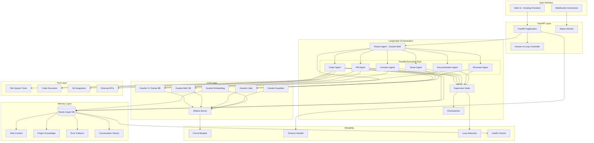
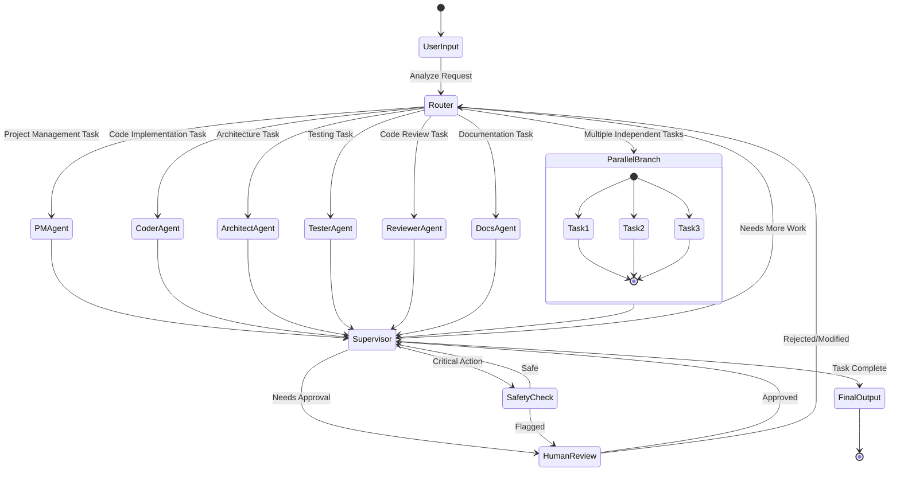
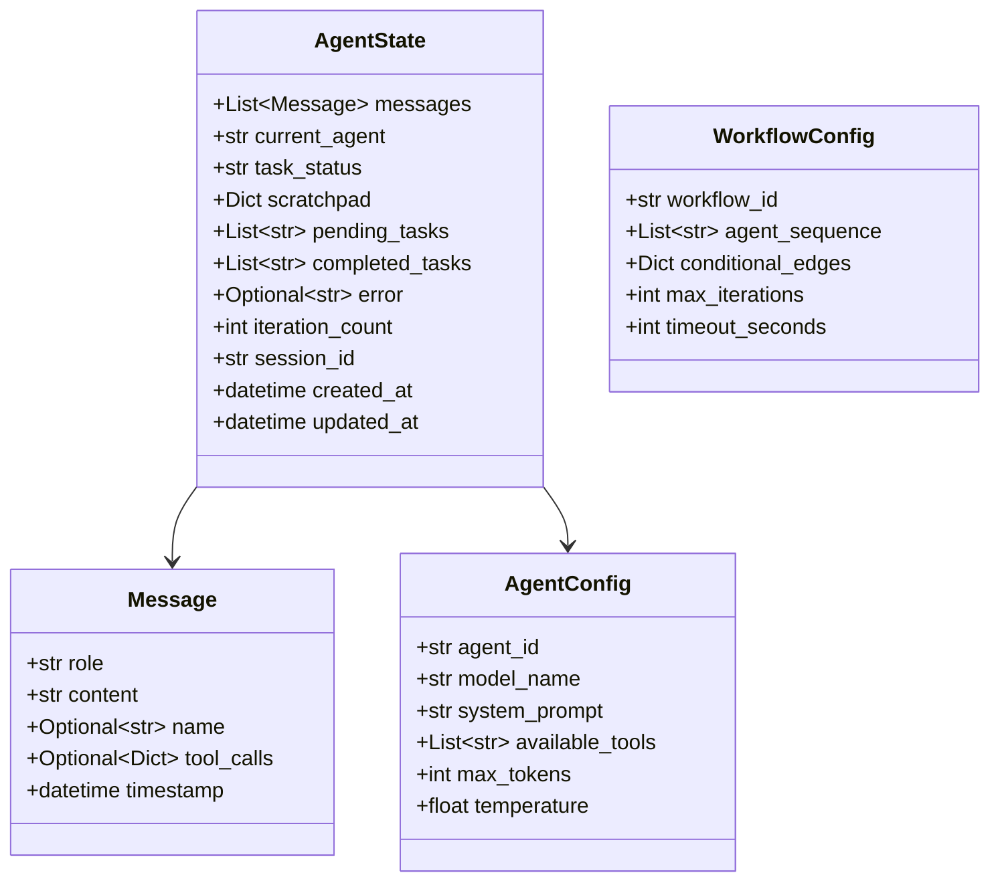
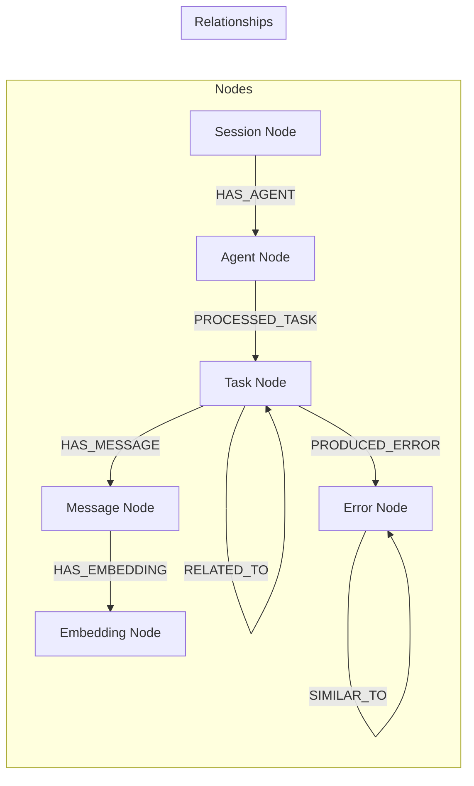
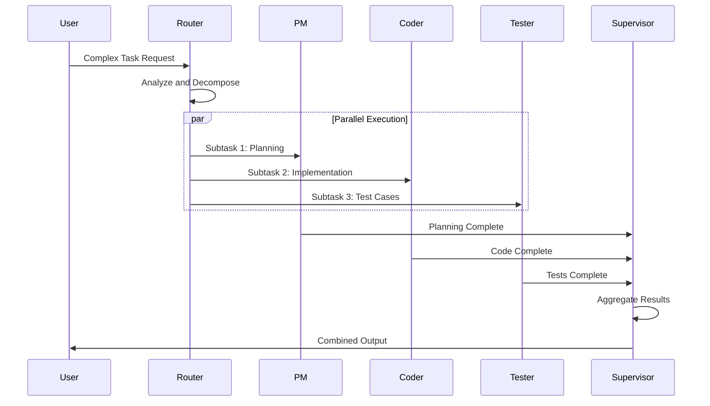
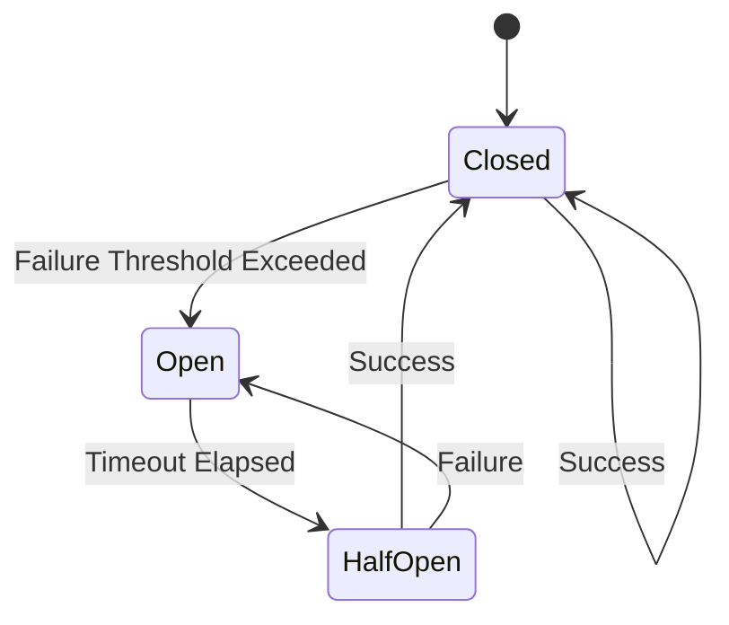
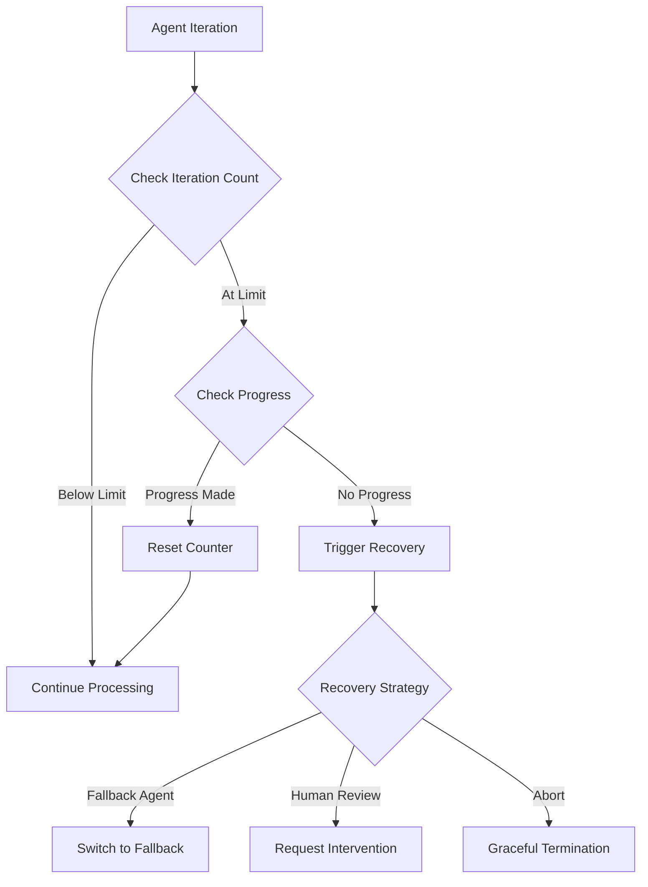
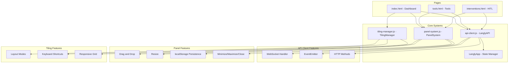

# Langly Multi-Agent Platform Architecture

## Overview

This document describes the architecture for a production-grade, parallel multi-agent coding platform using LangChain, LangGraph, Pydantic, FastAPI, and Ollama with IBM Granite models.

## Project Structure

```
langly/
├── app/
│   ├── __init__.py
│   ├── main.py                    # FastAPI application entry point
│   ├── config.py                  # Pydantic Settings configuration
│   ├── dependencies.py            # FastAPI dependency injection
│   │
│   ├── api/
│   │   ├── __init__.py
│   │   ├── agents.py              # Agent interaction endpoints
│   │   ├── workflows.py           # Workflow trigger and status endpoints
│   │   ├── memory.py              # Memory inspection endpoints
│   │   ├── tools.py               # Tool management endpoints
│   │   └── websocket.py           # Real-time WebSocket endpoints
│   │
│   ├── core/
│   │   ├── __init__.py
│   │   ├── schemas.py             # Pydantic models for state, messages, etc.
│   │   ├── exceptions.py          # Custom exception classes
│   │   └── constants.py           # Application constants and enums
│   │
│   ├── agents/
│   │   ├── __init__.py
│   │   ├── base.py                # Abstract base agent class
│   │   ├── pm_agent.py            # Project Manager agent
│   │   ├── coder_agent.py         # Coder implementation agent
│   │   ├── architect_agent.py     # System architect agent
│   │   ├── tester_agent.py        # Testing agent
│   │   ├── reviewer_agent.py      # Code review agent
│   │   ├── docs_agent.py          # Documentation agent
│   │   └── router_agent.py        # Router agent using Granite MoE
│   │
│   ├── graphs/
│   │   ├── __init__.py
│   │   ├── state.py               # AgentState TypedDict definition
│   │   ├── nodes.py               # Graph node functions
│   │   ├── edges.py               # Conditional edge functions
│   │   ├── workflows.py           # Compiled workflow graphs
│   │   └── checkpointer.py        # State persistence with checkpointing
│   │
│   ├── llm/
│   │   ├── __init__.py
│   │   ├── ollama_client.py       # Ollama connection wrapper
│   │   ├── granite_dense.py       # Granite 3.1 Dense model setup
│   │   ├── granite_moe.py         # Granite MoE model setup
│   │   ├── granite_code.py        # Granite Code model setup
│   │   ├── granite_embedding.py   # Granite Embedding model setup
│   │   └── granite_guardian.py    # Granite Guardian safety model
│   │
│   ├── memory/
│   │   ├── __init__.py
│   │   ├── neo4j_client.py        # Neo4j connection management
│   │   ├── schemas.py             # Neo4j node/relationship schemas
│   │   ├── task_memory.py         # Task context memory store
│   │   ├── project_memory.py      # Project knowledge store
│   │   ├── error_memory.py        # Error logs and patterns
│   │   ├── conversation_memory.py # Agent conversation history
│   │   └── retrieval.py           # Semantic search with embeddings
│   │
│   ├── tools/
│   │   ├── __init__.py
│   │   ├── registry.py            # Tool registration system
│   │   ├── filesystem.py          # File system operation tools
│   │   ├── code_execution.py      # Code execution sandbox
│   │   ├── git_tools.py           # Version control tools
│   │   └── api_tools.py           # External API calling framework
│   │
│   ├── reliability/
│   │   ├── __init__.py
│   │   ├── circuit_breaker.py     # Circuit breaker pattern
│   │   ├── timeout.py             # Timeout mechanisms
│   │   ├── loop_detection.py      # Loop detection and recovery
│   │   └── health.py              # Health check utilities
│   │
│   └── hitl/
│       ├── __init__.py
│       ├── intervention.py        # Human intervention points
│       ├── approval.py            # Approval request system
│       └── time_travel.py         # Time-travel debugging
│
├── static/                        # Existing frontend assets
│   ├── panel-system.css
│   ├── panel-system.js
│   ├── git-tree.css
│   ├── git-tree.js
│   ├── tiling-manager.css
│   └── tiling-manager.js
│
├── templates/
│   └── index.html                 # Main application template
│
├── tests/
│   ├── __init__.py
│   ├── test_agents/
│   ├── test_graphs/
│   ├── test_memory/
│   └── test_api/
│
├── pyproject.toml
├── docker-compose.yml             # Neo4j + App orchestration
├── .env.example
└── README.md
```

## System Architecture Diagram



## LangGraph Workflow Architecture



## Agent State Schema



## Neo4j Memory Schema



## IBM Granite Model Selection Strategy

| Agent Type | Primary Model | Fallback Model | Use Case |
|------------|--------------|----------------|----------|
| Router | Granite MoE 1B/3B | Granite Dense 2B | Fast routing decisions, low latency |
| PM Agent | Granite Dense 8B | Granite Dense 2B | Complex planning, coordination |
| Coder | Granite Code 8B | Granite Code 3B | Code generation, refactoring |
| Architect | Granite Dense 8B | Granite Dense 2B | System design, architecture |
| Tester | Granite Code 8B | Granite Code 3B | Test generation, analysis |
| Reviewer | Granite Code 8B | Granite Code 3B | Code review, suggestions |
| Documentation | Granite Dense 8B | Granite Dense 2B | Technical writing |
| Safety | Granite Guardian | N/A | Content safety validation |
| Memory | Granite Embedding | N/A | Semantic search, retrieval |

## Parallel Execution Design



## Reliability Patterns

### Circuit Breaker States



### Loop Detection Flow



## Development Iterations

### Iteration 1: Foundation
- Project structure setup
- Core Pydantic schemas
- Neo4j connection
- Basic FastAPI endpoints

### Iteration 2: LangGraph Core
- AgentState definition
- Basic graph nodes
- Simple linear workflow
- Checkpoint implementation

### Iteration 3: Ollama Integration
- Ollama client wrapper
- Granite model configuration
- Agent-model mapping
- Basic tool integration

### Iteration 4: Memory System
- Neo4j schema implementation
- Memory stores
- Embedding integration
- Semantic retrieval

### Iteration 5: Parallel Execution
- Parallel branch nodes
- Router with conditional edges
- Supervisor pattern
- State aggregation

### Iteration 6: Reliability
- Circuit breaker
- Timeout handling
- Loop detection
- Health checks

### Iteration 7: Human-in-the-Loop
- Intervention points
- Approval system
- Time-travel debugging
- Rollback capability

### Iteration 8: Tool Extensibility
- Tool registration
- File system tools
- Code execution sandbox
- External API framework

### Iteration 9: Frontend Integration
- FastAPI endpoint updates
- WebSocket real-time updates
- Intervention UI
- Tool management pages

### Iteration 10: Testing & Polish
- Unit tests
- Integration tests
- API documentation
- Developer guide

## Frontend Architecture

### Page Structure

```
static/
├── index.html              # Main dashboard - agent panels, conversation, workflow visualization
├── tools.html              # Tool management - registration, configuration, monitoring
├── interventions.html      # HITL interventions - approvals, time-travel debugging
├── api-client.js           # JavaScript API client with WebSocket support
├── panel-system.js         # Draggable panel system with minimize/maximize
├── panel-system.css        # Panel styling and animations
├── tiling-manager.js       # i3/dwm-style tiling window manager
├── tiling-manager.css      # Tiling layout styles
├── git-tree.js             # Git tree visualization
└── git-tree.css            # Git tree styles
```

### Frontend Component Diagram



### API Client Architecture

```javascript
// LanglyAPI class methods organized by domain
class LanglyAPI {
    // Health endpoints
    getHealth()
    getReadiness()
    getLiveness()
    
    // Task management
    createTask(taskData)
    getTask(taskId)
    listTasks(filters)
    updateTask(taskId, updates)
    cancelTask(taskId)
    
    // Workflow management
    createWorkflow(workflowData)
    getWorkflow(workflowId)
    listWorkflows(filters)
    pauseWorkflow(workflowId)
    resumeWorkflow(workflowId)
    
    // Agent management
    getAgent(agentId)
    listAgents()
    getAgentState(agentId)
    getAgentMetrics(agentId)
    
    // Tool management
    listTools()
    getTool(toolId)
    registerTool(toolConfig)
    updateTool(toolId, config)
    deleteTool(toolId)
    executeTool(toolId, params)
    
    // HITL interventions
    listInterventions(filters)
    approveIntervention(id, feedback)
    rejectIntervention(id, reason)
    requestMoreInfo(id, questions)
    
    // Time-travel debugging
    listCheckpoints(workflowId)
    createCheckpoint(workflowId, name)
    rollbackToCheckpoint(checkpointId)
    compareCheckpoints(cp1Id, cp2Id)
    
    // WebSocket
    connectWebSocket()
    disconnectWebSocket()
    sendWebSocketMessage(message)
}
```

### Panel System Features

| Feature | Description |
|---------|-------------|
| Drag and Drop | Move panels by dragging the header |
| Resize | Drag panel edges to resize |
| Minimize | Collapse panel to title bar only |
| Maximize | Expand panel to fill container |
| Close | Remove panel from view |
| Persistence | Layout saved to localStorage |
| Z-Index Management | Active panel brought to front |

### Tiling Manager Layouts

| Layout | Description | Keyboard |
|--------|-------------|----------|
| Grid | Equal-sized tiles in rows/columns | Alt+1 |
| Horizontal | Side-by-side horizontal split | Alt+2 |
| Vertical | Stacked vertical split | Alt+3 |
| Master-Stack | Large left panel, stacked right | Alt+4 |
| Cycle | Rotate through layouts | Alt+Space |

### WebSocket Event Types

```javascript
// Events emitted by api-client.js EventEmitter
{
    // Connection events
    'ws:connected': { timestamp },
    'ws:disconnected': { reason },
    'ws:error': { error },
    
    // Agent events
    'agent:status': { agentId, status, metrics },
    'agent:output': { agentId, content, timestamp },
    'agent:error': { agentId, error },
    
    // Workflow events
    'workflow:started': { workflowId, taskId },
    'workflow:progress': { workflowId, step, total },
    'workflow:completed': { workflowId, result },
    'workflow:failed': { workflowId, error },
    
    // HITL events
    'intervention:required': { id, type, context },
    'intervention:resolved': { id, resolution },
    
    // Tool events
    'tool:executed': { toolId, result, duration },
    'tool:error': { toolId, error }
}
```

### Dashboard Page Features

**index.html** provides:
- **Agent Status Panels**: Real-time status for PM Agent, Coder, Reviewer, Tester
- **Conversation Panel**: Chat interface for task input and agent communication
- **Workflow Visualization**: Graph view of current workflow state
- **Layout Controls**: Switch between grid, horizontal, vertical, master-stack layouts
- **Health Indicator**: Connection status and system health badge
- **WebSocket Integration**: Real-time updates without polling

### Tools Management Features

**tools.html** provides:
- **Category Sidebar**: Filter tools by File System, Code Execution, Version Control, External APIs, Database
- **Tools Grid**: Card-based view with status, usage stats, execution metrics
- **Add Tool Modal**: Form for registering new tools with name, category, description, implementation code, input schema
- **Configuration Panel**: Slide-out panel for tool settings, enable/disable toggle, rate limits, agent access controls
- **Tool Testing**: Execute tools directly to verify configuration

### HITL Interventions Features

**interventions.html** provides:
- **Interventions Sidebar**: List of pending/resolved interventions with priority indicators
- **Detail View**: Full context, requested action, agent reasoning, file preview
- **Action Buttons**: Approve, Reject, Request More Info with feedback input
- **Timeline View**: Chronological checkpoint history for time-travel debugging
- **State Comparison**: Side-by-side diff view for state changes
- **Rollback Controls**: One-click rollback to any checkpoint
